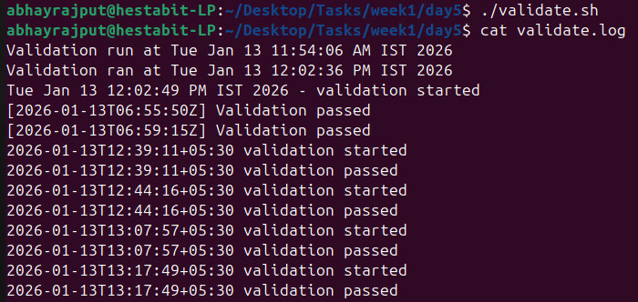
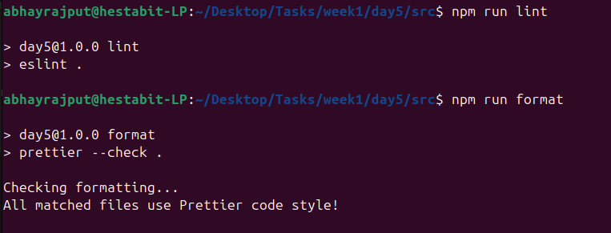
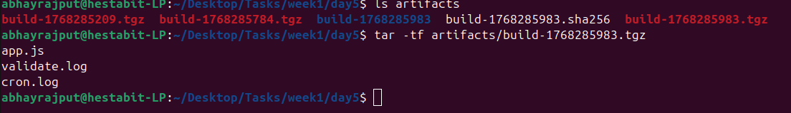
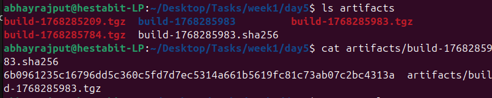
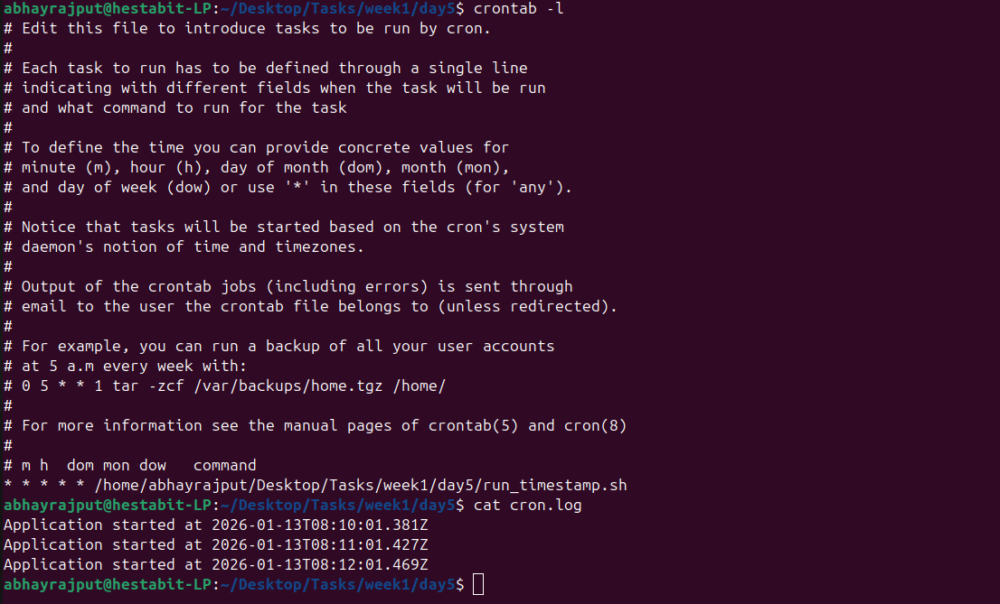

# Day -5 Automation & Mini CI Pipeline


## Directory Structure
day5/
├── src/
│   ├──  app.js
├── config.json
├── validate.sh
├── validate.log
├── run_timestamp.sh
├── cron.log
├── artifacts/
│   ├── build-1768285983.tgz
│   └── build-1768285983.sha256
├── .husky/
│   └── pre-commit
├── .eslintrc.json
├── .prettierrc
├── package.json
├── package-lock.json

## validate.sh
This script is used to validate the repository before allowing commits.

Validations performed:
 Ensure src/ directory exists
 Ensure config.json exists
 Ensure config.json is valid JSON
 Append validation logs with timestamps
 Exit with non-zero code on failure

Command used:
```
./validate.sh
```




## ESLint and Prettier

```npm run lint
npm run format```



## Husky Pre-Commit Hook

```echo "var x=" >> app.js
git add app.js
git commit -m "should fail"
```


## Build Artifact

```
tar -czf artifacts/build-<timestamp>.tgz app.js validate.sh validate.log config.json
```



##SHA256 checksum

```sha256sum artifacts/build-1768285983.tgz > artifacts/build-1768285983.sha256
```




## Cron job

```* * * * * /home/abhayrajput/Desktop/Tasks/week1/day5/run_timestamp.sh
```
logs are written 



Finished with all the tasks and the deliverables for day 5 
